# MosaicView

  

**MosaicView** is a desktop application for editing digital comics files — CBZ, CBR, CB7 and PDF — without ever having to open or extract them manually.

Designed for comic, manga and BD readers who want to organize, clean up and prepare their files quickly and intuitively.

This is my first application, and I hope you’ll like it. I don’t have any programming knowledge; I built it with the help of ClaudeCode. Feel free to hate me if it makes you feel better.

> ⚠️ **Active development** — features are being added regularly. Feedback and bug reports are welcome via [GitHub Issues](https://github.com/Bruno-Aublet/MosaicView/issues).

---

## The UI

Open an archive and its pages fill the window as thumbnails — your entire comic, at a glance. Everything is designed to be handled directly in that mosaic: drag pages to reorder them, drop files to add them, click to rename or delete. The goal was to make it feel like something you can figure out without reading the docs.

Thumbnail size is adjustable (3 sizes). The interface comes in light and dark themes. A fullscreen mode is also available.

The window can be split into two independent panels side by side, each with its own archive, its own undo/redo history, and its own toolbar. The divider between the two panels is freely resizable. Pages can be dragged from one panel to the other (i.e. moving pages from one archive to the other).

All operations are performed **directly on the archive** — no manual extraction required.

<p>
  <a href="Screenshots/001.png">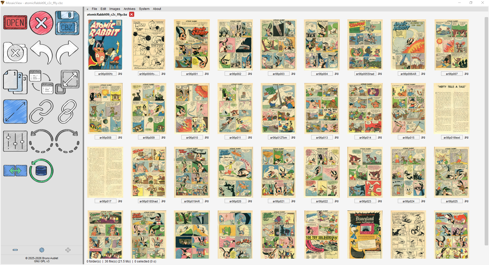</a>
  <a href="Screenshots/010.png">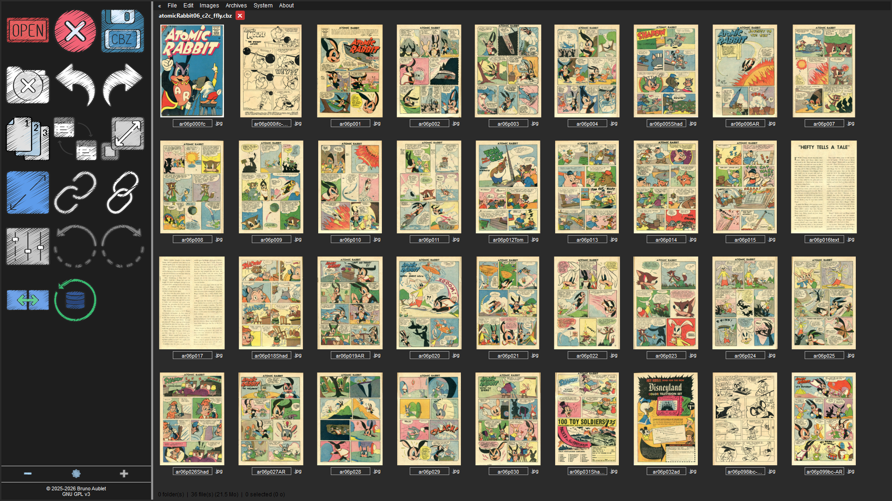</a>
  <a href="Screenshots/011.png">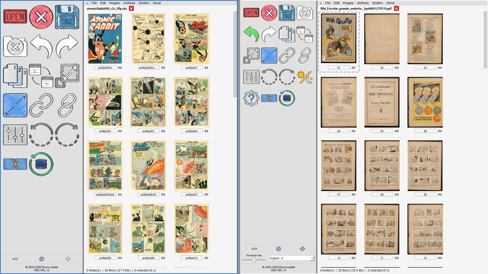</a>
</p>

---

## Supported formats

| Format | Read | Write |
|--------|------|-------|
| CBZ (ZIP) | ✅ | ✅ |
| CBR (RAR) | ✅ | — |
| CB7 (7-Zip) | ✅ | — |
| PDF | ✅ | — |

CBR, CB7 and PDF files are always exported as CBZ after editing. This is a deliberate choice: the ZIP engine is free and open, the RAR engine is proprietary, and 7-Zip is rarely used in practice for comics.

MosaicView also accepts loose image files (dragged individually or as a folder), in the following formats: JPG, PNG, GIF, WebP, BMP, TIFF, ICO, JFIF. 

---

## Languages

MosaicView is fully translated into **47 languages**, including English, French, German, Spanish, Japanese, Chinese, Arabic, and many more.

The interface language is detected automatically from your system settings.

For the adventurous, the interface is also available in **Klingon** and **Elvish** (Quenya and Sindarin) — each in two versions: Latin transliteration and native script.

<p>
  <a href="Screenshots/002.png">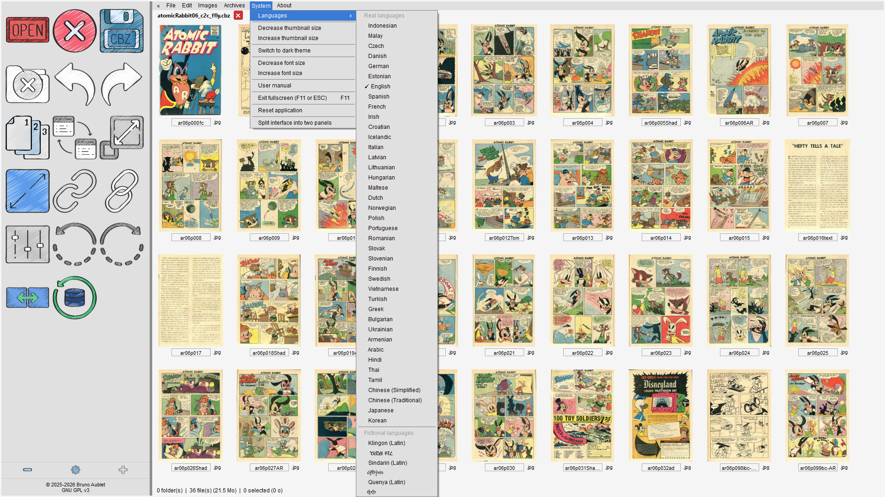</a>
  <a href="Screenshots/003.png">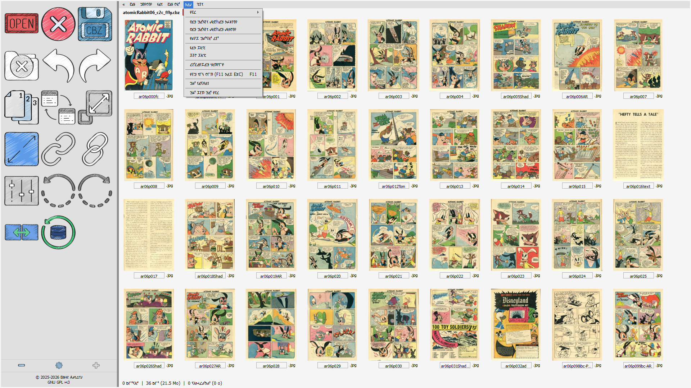</a>
  <a href="Screenshots/004.png">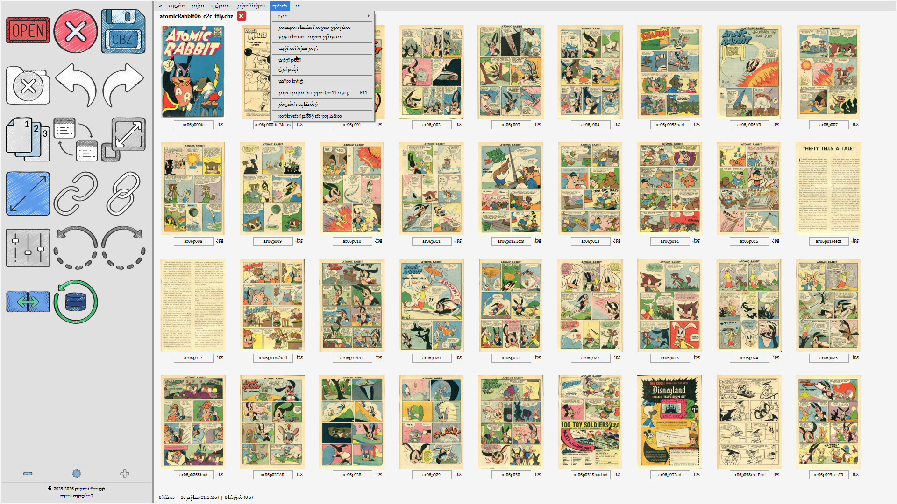</a>
</p>

The icon panel on the left is entirely optional. It can be hidden if you prefer a cleaner interface. When visible, it is fully customizable: you can adjust its width, choose which icons appear in it, change their size, and rearrange them freely within the column.

[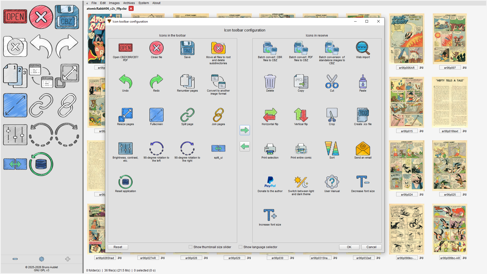](Screenshots/005.png)

---

## Features

- **Mosaic view** — browse all pages of an archive at a glance, as thumbnails
- **Reorder pages** — drag and drop pages into the right order directly in the mosaic
- **Rename pages** — edit filenames inline, without extracting anything
- **Delete pages** — remove unwanted pages in one click
- **Resize pages** — batch-resize all pages of an archive to a target resolution
- **Image adjustments** — brightness, contrast, gamma, sepia, black & white, and more, with a live preview
- **Merge archives** — combine multiple CBZ/CBR/CB7/PDF files into one (especially useful for variant covers)
- **Convert formats** — batch-convert CBR → CBZ, PDF → CBZ, or image folders → CBZ
- **Renumber pages** — two modes: simple sequential renumbering (01, 02, 03…), or smart renumbering that detects double-page spreads by their aspect ratio and generates compound names (01-02, 03, 04-05…)
- **Image viewer** — double-click any page to open a full viewer: navigate with arrow keys or mouse wheel, zoom with Ctrl+scroll, pan with right-click drag, toggle fullscreen with F11 or double-click. Three reading modes: single page, double-page spread, and continuous scroll. Animated GIFs are played back with a Play/Pause button. Cropping is also available directly from the viewer.
- **Sort pages** — sort all pages by name, file type, file size, width, height, resolution, or DPI
- **Rotate / flip** — rotate pages 90° left or right, or flip them horizontally or vertically
- **Manual crop** — crop any page by drawing a selection directly on the image
- **Split** — cut a page into N equal parts, horizontally or vertically
- **Join** — combine multiple selected pages into a single image by positioning them freely, with a live preview
- **Animated GIF export** — generate an animated GIF from the pages of an archive
- **ICO export** — create an icon file from a page
- **Flatten subdirectories** — some archives store pages in a subfolder structure; this flattens everything to the root level in one click, with automatic conflict resolution if two files share the same name
- **Undo / Redo** — every operation is reversible
- **Corrupted page detection** — unreadable or damaged pages are flagged visually in the mosaic
- **Automatic update check** — on startup, MosaicView silently checks GitHub Releases in the background; if a newer version is available, a banner appears in the window and the menu is updated. No notification if already up to date or if there is no network. A manual check is also available from the menu.

<p>
  <a href="Screenshots/006.png">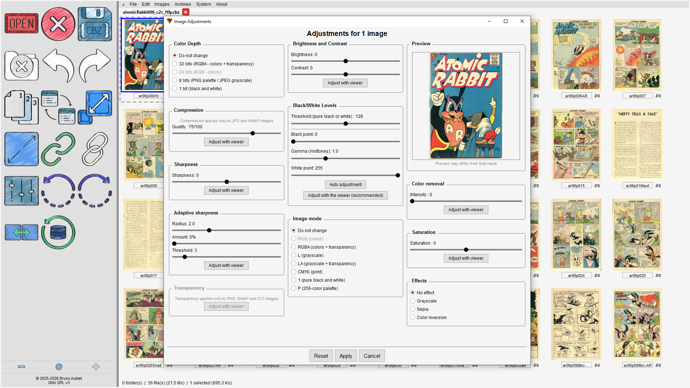</a>
  <a href="Screenshots/007.png">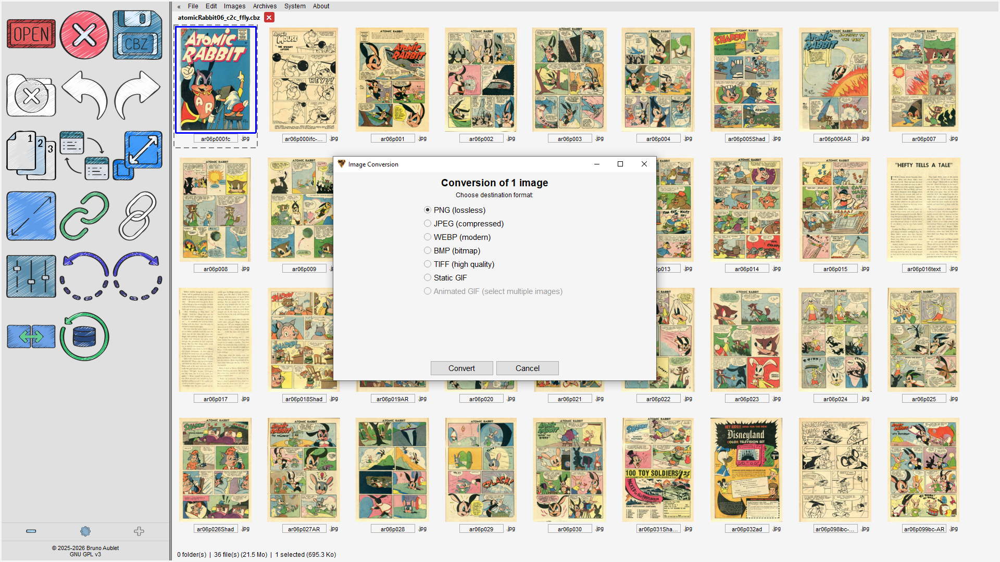</a>
  <a href="Screenshots/008.png">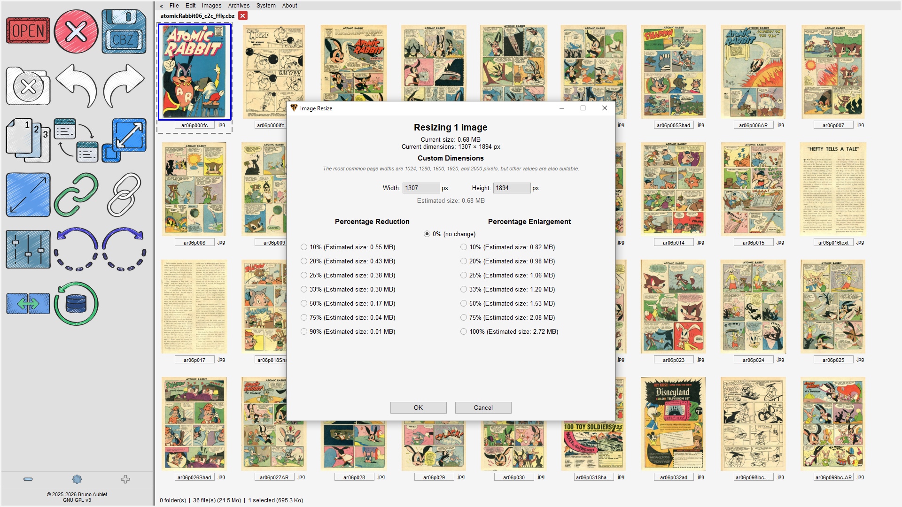</a>
</p>

---

## Batch conversions

Batch conversions can be launched from the menu, or by dropping a folder directly onto the window. All batch operations scan the folder recursively and show a confirmation dialog before starting, with a progress bar and a summary at the end.

- **CBR → CBZ** — converts all CBR files in a folder to CBZ
- **PDF → CBZ** — converts all PDF files in a folder to CBZ, extracting each page as an image
- **Images → CBZ** — packages loose image files into CBZ archives, with two modes: one CBZ per image, or all images grouped into a single CBZ

[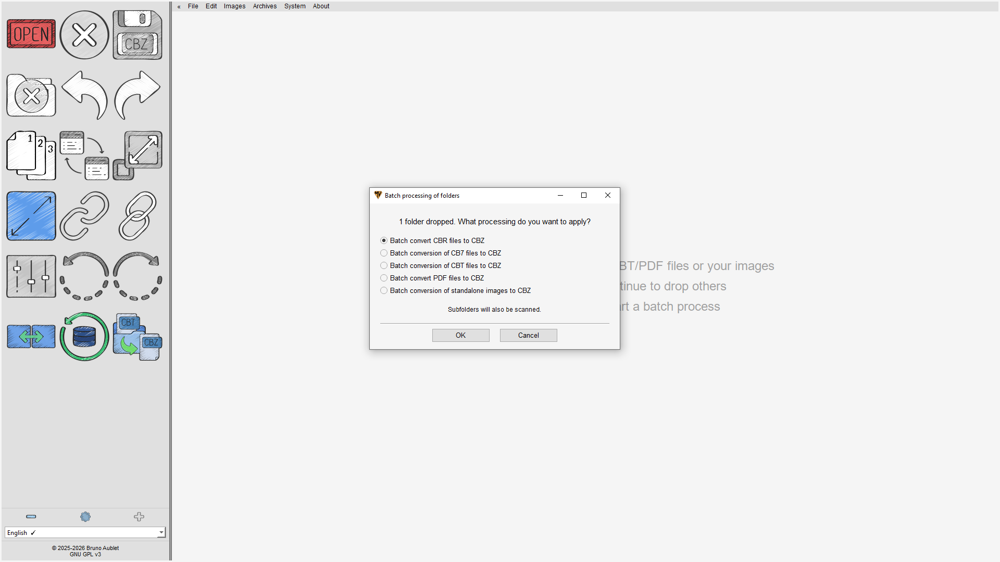](Screenshots/009.png)

---

## Requirements

- Python 3.11+
- Dependencies (install with `pip install -r requirements.txt`):

```
PySide6, Pillow, numpy, rarfile, PyMuPDF
```

- **UnRAR** (for CBR support): place `UnRAR.exe` in the `unrar/` folder
  → Download from [rarlab.com](https://www.rarlab.com/rar_add.htm)

- **7-Zip** (for CB7 support): place `7z.exe` and `7z.dll` in the `7zip/` folder
  → Download from [7-zip.org](https://www.7-zip.org/)

---

## Download

Pre-built executables for Windows are available on the [Releases page](https://github.com/Bruno-Aublet/MosaicView/releases/latest).

## Installation

```bash
git clone https://github.com/Bruno-Aublet/MosaicView.git
cd MosaicView
pip install -r requirements.txt
python MosaicView.py
```

Two PyInstaller spec files are included for building a standalone executable: `MosaicView_ONE_DIR.spec` (faster startup, distributes as a folder) and `MosaicView_ONE_FILE.spec` (single executable, slower startup). Build with `pyinstaller MosaicView_ONE_DIR.spec` or `pyinstaller MosaicView_ONE_FILE.spec`.

---

## License

MosaicView is released under the **GNU General Public License v3.0**.
See [LICENSE](LICENSE) for details.

---

## Third-party components

| Component | Use | License |
|-----------|-----|---------|
| [UnRAR](https://www.rarlab.com/rar_add.htm) (RARlab) | CBR/RAR extraction | Freeware, non-commercial use |
| [7-Zip](https://www.7-zip.org/) (Igor Pavlov) | CB7 extraction | GNU LGPL |

License files are included in the `unrar/` and `7zip/` folders. All third-party licenses are also available directly within the application.

---

## Contact

**Bruno Aublet** — [GitHub](https://github.com/Bruno-Aublet) — [mosaicview1969@gmail.com](mailto:mosaicview1969@gmail.com)
