# MosaicView

  

🌐 [https://bruno-aublet.github.io/MosaicView/](https://bruno-aublet.github.io/MosaicView/)

**MosaicView** is a desktop application for editing digital comics files — CBZ, CBR, CB7, CBT and PDF — without ever having to open or extract them manually.

**This is NOT a reader, although it has a viewer. It is an editing tool for comic archives.**

Designed for comic, manga and BD readers who want to organize, clean up and prepare their files quickly and intuitively.

This is my first application, and I hope you’ll like it. I have absolutely no programming knowledge. None, zero, nada. I built MosaicView with the help of Claude Code. Yes, I used an AI to write this program. You can hate me if it makes you feel better.

> ⚠️ **Active development** — features are being added regularly.

## 💬 Feedback wanted

I'd love to hear from you: what works, what doesn't, what's missing, what's confusing. This project only gets better with real feedback from real users.

- **Bug reports** → [GitHub Issues](https://github.com/Bruno-Aublet/MosaicView/issues)
- **Ideas, suggestions, general feedback** → [GitHub Discussions](https://github.com/Bruno-Aublet/MosaicView/discussions)
- **Anything else**  → [mosaicview1969@gmail.com](mailto:mosaicview1969@gmail.com?subject=MosaicView)

---

## The Mosaic View

Open an archive and its pages fill the window as thumbnails — your entire comic, at a glance. Everything is designed to be handled directly in that mosaic: drag pages to reorder them, drop files to add them, click to rename or delete. The goal was to make it feel like something you can figure out without reading the docs.

Thumbnail size is adjustable (3 sizes), via the slider or Ctrl+scroll wheel directly on the mosaic. The interface comes in light and dark themes. A fullscreen mode is also available.

The window can be split into two independent panels side by side, each with its own archive, its own undo/redo history, and its own toolbar. The divider between the two panels is freely resizable. Pages can be dragged from one panel to the other (i.e. moving pages from one archive to the other).

All operations are performed **directly on the archive** — no manual extraction required.

<p>
  <a href="Screenshots/001.png">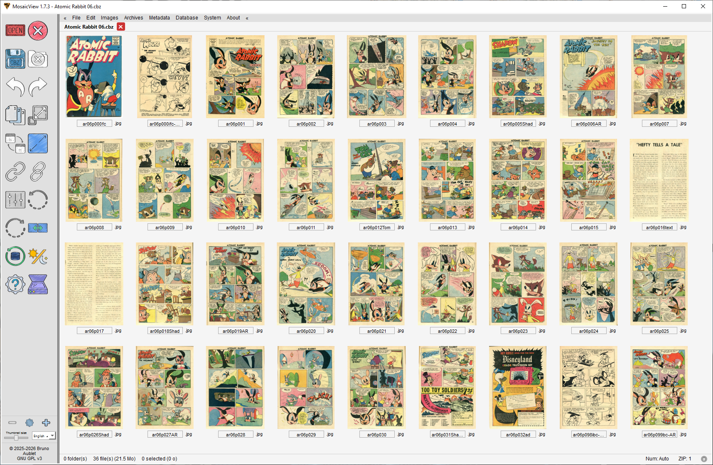</a>
  <a href="Screenshots/010.png">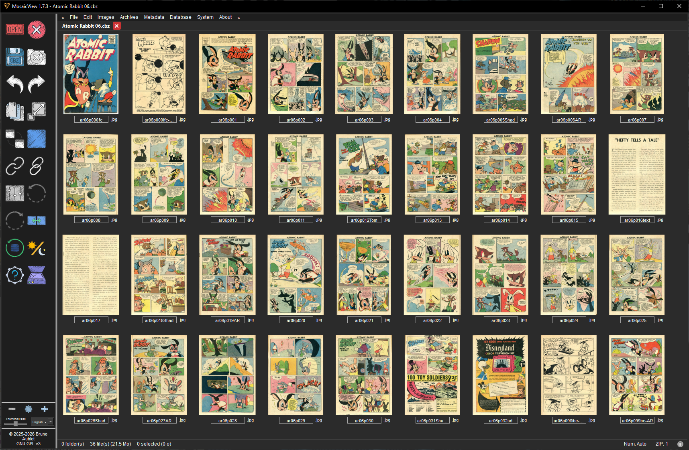</a>
  <a href="Screenshots/011.png">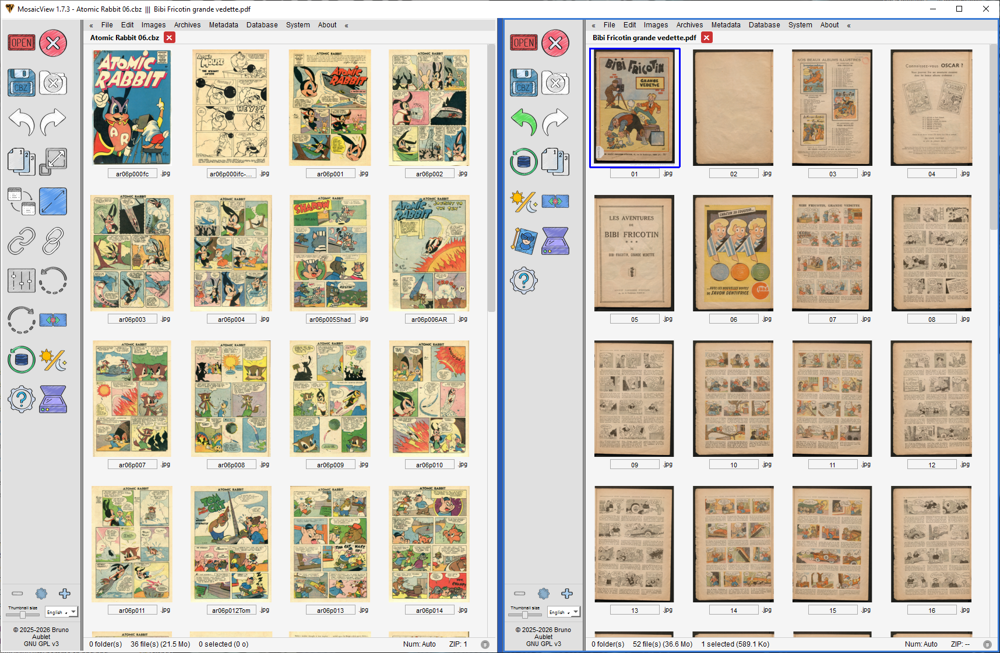</a>
</p>

---

## Supported formats

| Format | Read | Write |
|--------|------|-------|
| CBZ (ZIP) | ✅ | ✅ |
| CBR (RAR) | ✅ | — |
| CB7 (7-Zip) | ✅ | — |
| CBT (TAR) | ✅ | — |
| PDF | ✅ | — |
| EPUB | ✅ (images only) | — |

CBR, CB7, CBT and PDF files are always exported as CBZ after editing. This is a deliberate choice: the ZIP engine is free and open, while RAR is proprietary, 7-Zip and TAR are rarely used in practice for comics.

MosaicView also detects misnamed archives (e.g. a CBR file saved with a `.cbz` extension) and offers to rename them automatically.

MosaicView also accepts loose image files (dragged individually or as a folder), in the following formats: JPG, PNG, GIF, WebP, AVIF, BMP, TIFF, ICO, JFIF.

---

## Languages

MosaicView is fully translated into **46 languages**, including English, French, German, Spanish, Japanese, Chinese, Arabic, and many more.

The interface language is detected automatically from your system settings.

For the adventurous, the interface is also available in **Klingon** and **Elvish** (Quenya and Sindarin) — each in two versions: Latin transliteration and native script.

<p>
  <a href="Screenshots/002.png">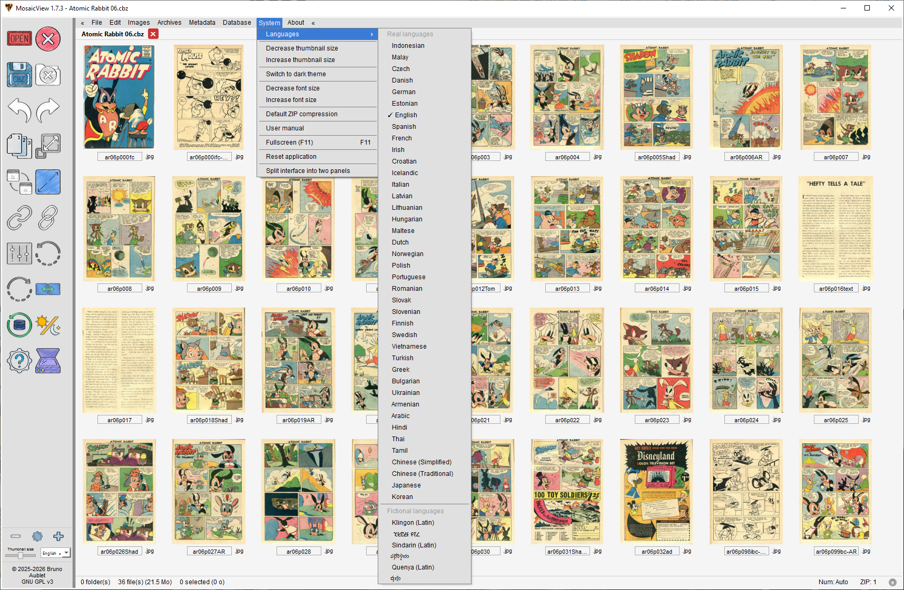</a>
  <a href="Screenshots/003.png">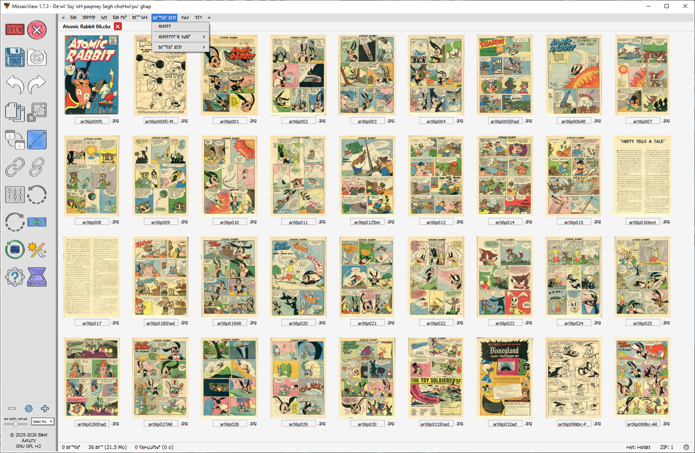</a>
  <a href="Screenshots/004.png">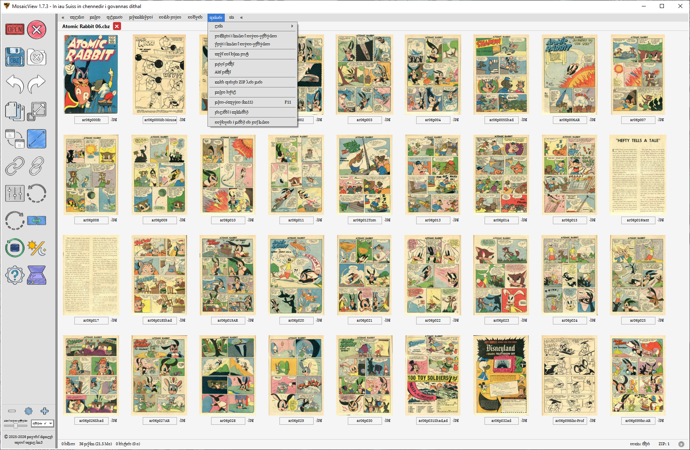</a>
</p>

The icon panel on the left is entirely optional. It can be hidden if you prefer a cleaner interface. When visible, it is fully customizable: you can adjust its width, choose which icons appear in it, change their size, and rearrange them freely within the column.

[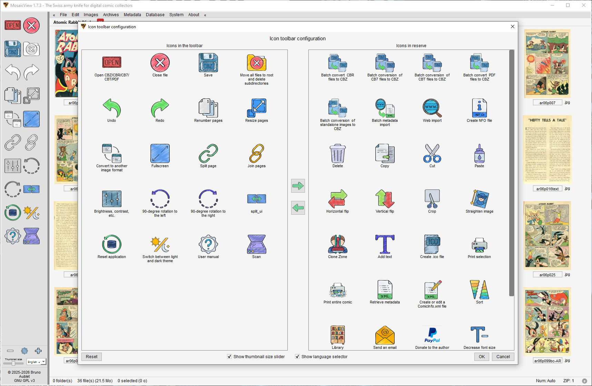](Screenshots/005.png)

---

## Features

- **Mosaic view** — browse all pages of an archive at a glance, as thumbnails
- **Minimap** — an optional side panel showing a miniature overview of the whole mosaic, with a rectangle marking the currently visible area. Drag the rectangle or click anywhere on the minimap to jump straight to that spot; the mosaic and the minimap scroll together in both directions. Hidden by default, toggle it from the menu bar or the right-click context menu.
- **Reorder pages** — drag and drop pages into the right order directly in the mosaic
- **Rename pages** — edit filenames inline, without extracting anything
- **Delete pages** — remove unwanted pages in one click
- **Resize pages** — batch-resize all pages of an archive to a target resolution
- **Image adjustments** — brightness, contrast, gamma, sepia, black & white, and more, with a live preview
- **Merge archives** — combine multiple CBZ/CBR/CB7/CBT/PDF files into one (especially useful for variant covers)
- **Convert formats** — batch-convert CBR → CBZ, CB7 → CBZ, CBT → CBZ, PDF → CBZ, or image folders → CBZ
- **Renumber pages** — three modes: simple sequential renumbering (01, 02, 03…), smart renumbering that detects double-page spreads by their aspect ratio and generates compound names (01-02, 03, 04-05…), or OFF to keep original filenames untouched. The active mode is shown in a clickable status bar indicator and is remembered between sessions.
- **ZIP compression** — a configurable default compression level (0-9, defaulting to no compression) is applied whenever a CBZ is saved, since comic images are already compressed by their own format and ZIP compression on top brings no real space savings while slowing down saving and reading. A status bar indicator shows the compression state of the currently open file and offers to resave it at the default level when relevant.
- **Image viewer** — double-click any page to open a full viewer: navigate with arrow keys or mouse wheel, zoom with Ctrl+scroll, pan with right-click drag, toggle fullscreen with F11 or double-click. Three reading modes: single page, double-page spread, and continuous scroll. Animated GIFs are played back with a Play/Pause button. Cropping is also available directly from the viewer. A **bookmark** is automatically saved when closing the viewer (except on the first and last page) — a red ribbon icon appears on the corresponding thumbnail in the mosaic. On the next opening, a prompt offers to resume reading from that page.
- **Sort pages** — sort all pages by name, file type, file size, width, height, resolution, or DPI
- **Rotate / flip** — rotate pages 90° left or right, or flip them horizontally or vertically
- **Manual crop** — crop any page by drawing a selection directly on the image
- **Straighten** — correct a slightly tilted scan by drawing a reference line on what should be horizontal or vertical; the exact correction angle is calculated automatically and applied to the image. The reference line has draggable endpoints for fine-tuning.
- **Clone Zone** — paint over unwanted elements (logos, watermarks, stray marks) by cloning a nearby area of the image. Ctrl+click sets the source; left-click paints. Two modes: Fixed (each stroke restarts from the same source point) and Relative (the source advances with the brush). Adjustable brush size from 1 to 200 px.
- **Text insertion** — add rich-text overlays directly onto a page. Multiple independent text blocks can be placed simultaneously by clicking on the image. Each block supports per-selection bold, italic, and underline formatting, a freely chosen font family and size, and a custom color with alpha channel. Blocks can be moved pixel-by-pixel with Ctrl+arrow keys or dragged freely. Applying flattens all blocks onto the image at once.
- **Split** — cut a page into N equal parts, horizontally or vertically
- **Join** — combine multiple selected pages into a single image by positioning them freely, with a live preview
- **Animated GIF export** — generate an animated GIF from the pages of an archive
- **ICO export** — create an icon file from a page
- **NFO file editor** — create `.nfo` files directly inside an archive from the toolbar, the File menu, or the right-click context menu. The non-modal dialog lets you enter a filename and write free-form text content; the file is injected into the mosaic immediately. Double-clicking an existing `.nfo` file in the mosaic opens it in the same integrated editor for editing. Both creation and editing are recorded in the undo/redo history.
- **Flatten subdirectories** — some archives store pages in a subfolder structure; this flattens everything to the root level in one click, with automatic conflict resolution if two files share the same name
- **Undo / Redo** — every operation is reversible
- **Corrupted page detection** — unreadable or damaged pages are flagged visually in the mosaic
- **Duplicate page detection** — pages with strictly identical content (a common side effect of scanning or merging errors) are flagged with a badge in the mosaic. "Manage duplicates" (menu bar, right-click on the mosaic, or right-click on a thumbnail) opens a window listing every group of identical pages with a thumbnail and a checkbox per page, letting you review and delete the extras in one go.
- **Fullscreen mode** — toggle fullscreen at any time from the toolbar or with F11
- **ComicInfo.xml editor** — create or edit the ComicInfo.xml metadata file embedded in an archive directly from MosaicView. See the Metadata section below.
- **Automatic update check** — on startup, MosaicView silently checks GitHub Releases in the background; if a newer version is available, a banner appears in the window and the menu is updated. No notification if already up to date or if there is no network. A manual check is also available from the menu.

<p>
  <a href="Screenshots/006.png">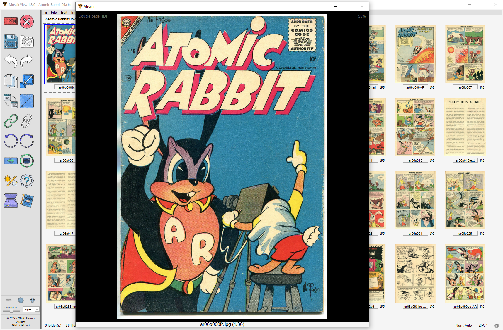</a>
  <a href="Screenshots/007.png">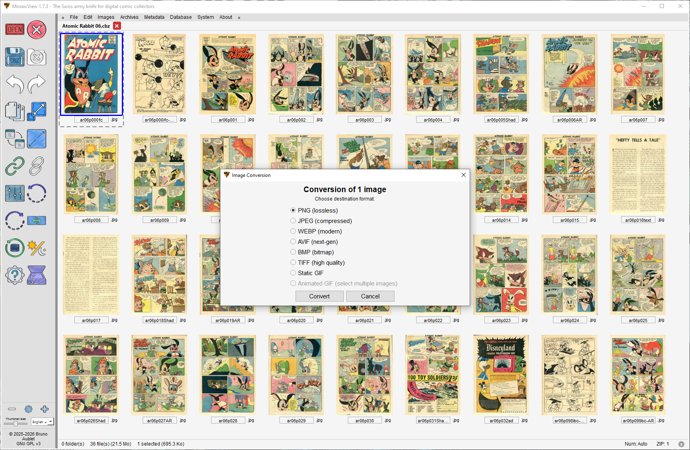</a>
  <a href="Screenshots/008.png">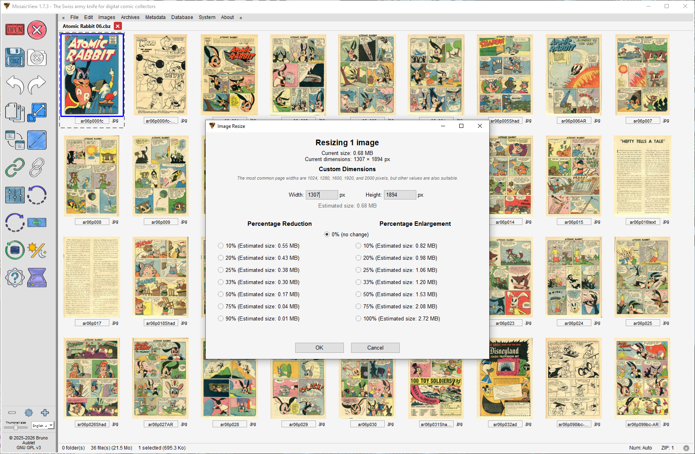</a>
</p>

---

## Batch conversions

Batch conversions can be launched from the toolbar, the menu bar, the right-click context menu, or by dropping a folder directly onto the window. All batch operations scan the folder recursively and show a confirmation dialog before starting, with a progress bar and a summary at the end.

- **CBR → CBZ** — converts all CBR files in a folder to CBZ. Misnamed CBR files that are actually ZIP, 7z, or TAR archives are automatically renamed to the correct extension (.cbz, .cb7, .cbt).
- **CB7 → CBZ** — converts all CB7 files in a folder to CBZ. Misnamed CB7 files that are actually ZIP, RAR, or TAR archives are automatically renamed to the correct extension (.cbz, .cbr, .cbt).
- **CBT → CBZ** — converts all CBT files in a folder to CBZ. Misnamed CBT files that are actually ZIP, RAR, or 7z archives are automatically renamed to the correct extension (.cbz, .cbr, .cb7).
- **PDF → CBZ** — converts all PDF files in a folder to CBZ, extracting each page as an image
- **Images → CBZ** — packages loose image files into CBZ archives, with two modes: one CBZ per image, or all images grouped into a single CBZ
- **Metadata import** — automatically retrieves metadata (title, series, authors…) from ComicVine for all compatible files in a folder. A wizard opens successively for each file. See the Metadata section below.
- **Create library** — indexes all compatible files in a folder into a new MosaicView library (*.mvdb). See the Library section below.
- **Recompress CBZ at default level** — scans a folder for CBZ/CBR/CB7/CBT files, detects the real format of each by magic bytes (catching files saved with the wrong extension in either direction), renames mis-named CBZ files to the correct extension, and recompresses every CBZ not already at the configured default ZIP compression level. See the ZIP compression entry above.

When renamed files or errors occur, a log file is created and a link to it is shown in the summary dialog.

[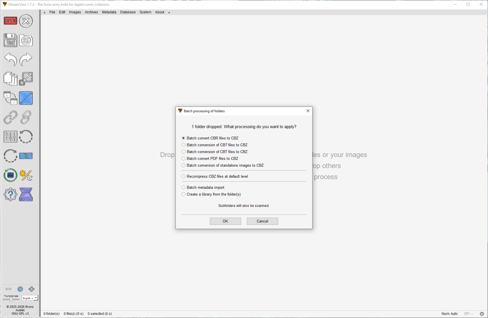](Screenshots/009.png)

---

## Metadata

MosaicView can automatically retrieve metadata (title, series, issue number, authors, publisher, summary…) from [ComicVine](https://comicvine.gamespot.com/), a community-maintained comics database.

A free ComicVine API key is required. The application will guide you through obtaining one. The key is never stored in plain text, it is encrypted using Windows DPAPI and can only be read by the same Windows user account.

This feature is entirely based on the open source project [cbanack/comic-vine-scraper](https://github.com/cbanack/comic-vine-scraper).

- **Single file** — open a file, then use the toolbar button or the Metadata menu. A two-step wizard lets you pick the series, then the matching issue. Metadata is written as a `ComicInfo.xml` file inside the archive.
- **Batch mode** — drop one or more folders onto the mosaic and choose "Metadata import", or use the dedicated toolbar button. The wizard opens for each compatible file (CBZ, CBR, CB7, CBT, PDF) found in the folder and its subfolders. Non-CBZ files are automatically converted to CBZ after writing.
- **Source traceability** — every metadata import records the source page URL in the `Web` field and adds a dated line ("MosaicView: metadata retrieved on...") to the `Notes` field, both fully editable like any other field. A newer import updates that line in place rather than stacking up.

---

## Library

The library lets you catalogue and search your entire digital comics collection. It works by reading the metadata already present in each file (title, series, authors, publisher…) and gathering it into a single library file (`*.mvdb`).

- **Create** — use the Library menu → New database, or drop one or more folders onto the mosaic and choose "Create a library from the folder(s)". MosaicView scans the folders and indexes all compatible files automatically.
- **Search** — filter by series, author, year, publisher, and more, combining as many criteria as needed (AND/OR).
- **Open** — double-click any entry to open the file directly in MosaicView. An "Open in MosaicView" button is also available in the preview panel. The right-click menu also offers "Open with default application" to launch the file with whatever program Windows has associated with it.
- **Drag and drop into the mosaic** — selected entries can be dragged straight from the library table onto a panel: a single file opens it, multiple files merge them, exactly like dropping files from Windows Explorer.
- **Edit metadata** — comics that already have a ComicInfo.xml can be edited directly from the library without opening the file first.
- **Export** — the "Export results" button saves the current table to an Excel file (*.xlsx).

---

## Windows integration

MosaicView only ever runs as a single instance. If you double-click a comic file or a MosaicView library while the app is already open, it won't launch a second window. The file simply opens in the instance that's already running, which is brought to the front.

MosaicView also registers itself with Windows so it shows up in the "Open with" list for comic archives and images, under the name "MosaicView". This just makes it available as a choice ; setting it as the default application for a file type is still done the usual Windows way (right-click a file → "Open with" → "Choose another app" → check "Always use this app").

---

## Requirements

*Only needed when running from source — the pre-built executables (see [Download](#download)) already include UnRAR and 7-Zip.*

- Python 3.11+
- Dependencies (install with `pip install -r requirements.txt`):

```
PySide6, Pillow, numpy, rarfile, PyMuPDF, packaging, openpyxl, pywin32, send2trash, defusedxml
```

- **UnRAR** (for CBR support): place `UnRAR.exe` in the `unrar/` folder
  → Download from [rarlab.com](https://www.rarlab.com/rar_add.htm)

- **7-Zip** (for CB7 support): place `7z.exe` and `7z.dll` in the `7zip/` folder
  → Download from [7-zip.org](https://www.7-zip.org/)

---

## Download

Pre-built executables for Windows are available on the [Releases page](https://github.com/Bruno-Aublet/MosaicView/releases/latest). Each release provides two versions:

- **ONE DIR** — starts faster, distributed as a ZIP archive containing a folder
- **ONE FILE** — single `.exe` file, no need to unzip, more compact, slower startup

## Installation

```bash
git clone https://github.com/Bruno-Aublet/MosaicView.git
cd MosaicView
pip install -r requirements.txt
python MosaicView.py
```

Two PyInstaller spec files are included for building a standalone executable (see the ONE DIR / ONE FILE difference above): build with `pyinstaller MosaicView_ONE_DIR.spec` or `pyinstaller MosaicView_ONE_FILE.spec`.

---

## License

MosaicView is released under the **GNU General Public License v3.0**.
See [LICENSE](LICENSE) for details.

---

## Third-party components

| Component | Use | License |
|-----------|-----|---------|
| [UnRAR](https://www.rarlab.com/rar_add.htm) (RARlab) | CBR/RAR extraction | Freeware, non-commercial use |
| [7-Zip](https://www.7-zip.org/) (Igor Pavlov) | CB7 extraction | GNU LGPL |

License files are included in the `unrar/` and `7zip/` folders. All third-party licenses are also available directly within the application.

---

## Contact

**Bruno Aublet** — [GitHub](https://github.com/Bruno-Aublet) —  [mosaicview1969@gmail.com](mailto:mosaicview1969@gmail.com)
